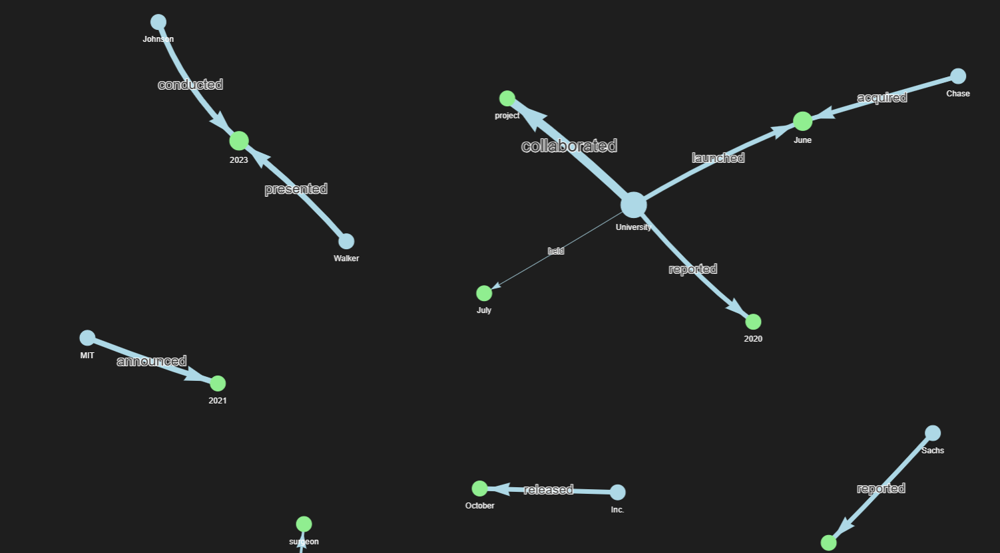

# 🧩 Mini Knowledge Graph Builder

## 📘 Overview
The **Mini Knowledge Graph Builder** is a Python-based project that extracts entities and relationships from text data and visualizes them in the form of an interactive **Knowledge Graph**.  
It demonstrates core concepts of **Natural Language Processing (NLP)**, **Relation Extraction**, and **Graph Visualization**.

This project was developed as part of **Milestone 1**, covering:
- Project structure and setup  
- Data preparation  
- Named Entity Recognition (NER)  
- Relation extraction  
- Graph creation and visualization  

---

## 📂 Project Structure
```
Mini_KnowledgeGraph/
│
├── data/
│   ├── cross_domain_dataset.csv         # Input text dataset
│   ├── entities.csv                     # Extracted entities (from NER)
│   ├── relations.csv                    # Extracted relationships
│   └── extracted_triples.csv            # Combined (Subject, Relation, Object)
│
├── modules/
│   ├── ner_extraction.py                # Code for Named Entity Recognition
│   ├── relation_extraction.py           # Code for extracting relationships
│   └── graph_builder.py                 # Code for building and visualizing graph
│
├── ui/
│   └── expanded_knowledge_graph.html    # Interactive graph output (PyVis)
│
├── README.md                            # Project summary and documentation
└── Mini_KnowledgeGraph_Report.docx      # Final milestone report
```

---

## ⚙️ Setup Instructions

### 1️⃣ Install Dependencies
```bash
pip install pandas spacy networkx pyvis matplotlib
python -m spacy download en_core_web_sm
```

### 2️⃣ Run the Scripts
1. **Entity Extraction**
   ```bash
   python modules/ner_extraction.py
   ```

2. **Relation Extraction**
   ```bash
   python modules/relation_extraction.py
   ```

3. **Graph Building & Visualization**
   ```bash
   python modules/graph_builder.py
   ```

After running the last step, an interactive graph file will be saved as:
```
ui/expanded_knowledge_graph.html
```
You can open it in your browser to explore the knowledge graph.

---

## 📊 Sample Output

Below are example screenshots from the generated graph:

| Visualization 1 | Visualization 2 |
|-----------------|-----------------|
|  |  |


---

## 🧠 How It Works
1. **Named Entity Recognition (NER):**  
   Extracts entities like *people, organizations, and years* using SpaCy.

2. **Relation Extraction:**  
   Identifies relationships between entities such as *“launched,” “announced,” “collaborated,”* etc.

3. **Knowledge Graph Creation:**  
   Entities become **nodes** and relationships become **edges**, forming a directed graph.

4. **Interactive Visualization:**  
   The final graph is visualized using **PyVis**, where:
   - Subjects → 🔵 Light Blue  
   - Objects → 🟢 Light Green  
   - Relations are labeled arrows connecting them.

---

## 🧾 Example Triples
| Subject | Relation | Object |
|----------|-----------|--------|
| University | launched | June |
| Johnson | conducted | 2023 |
| MIT | announced | 2021 |

---

## 💡 Reflection
> Through this milestone, I learned how to extract meaningful knowledge from unstructured text and represent it visually.  
> I also understood how different NLP modules work together to build a functional AI-driven graph system.

---

## 👨‍💻 Author
**Saivignesh Marapelli**  
📅 *Milestone 1 – AI KnowMap Project*  
📍 Developed using Python, SpaCy, NetworkX, and PyVis  
